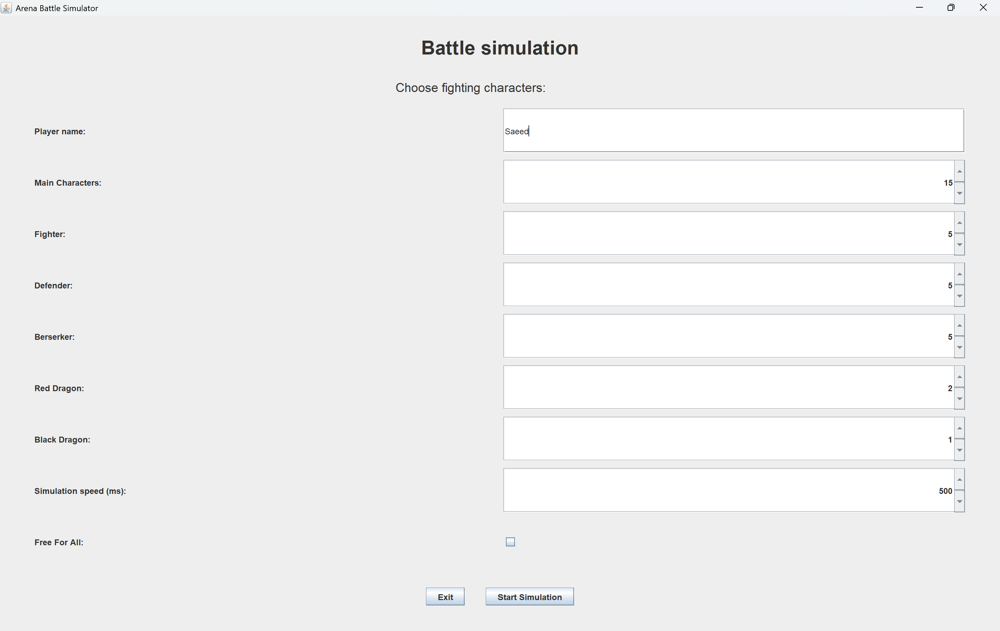
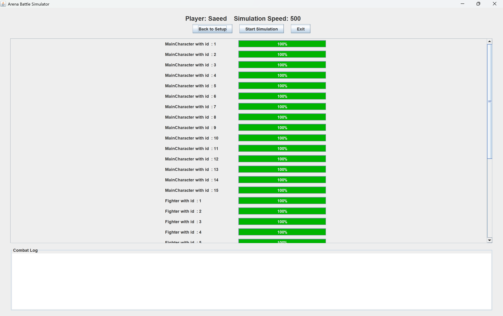
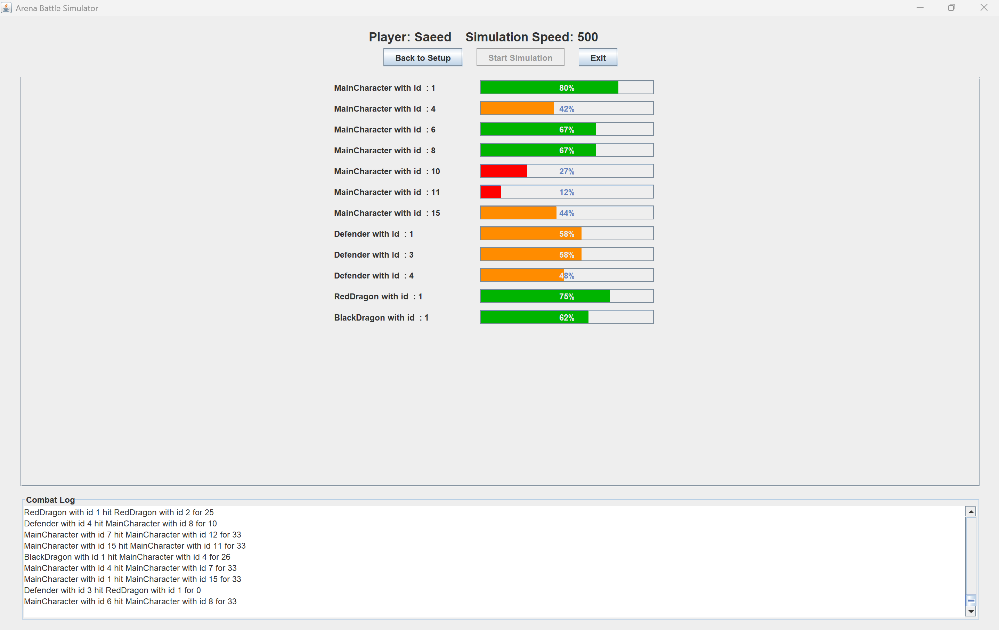
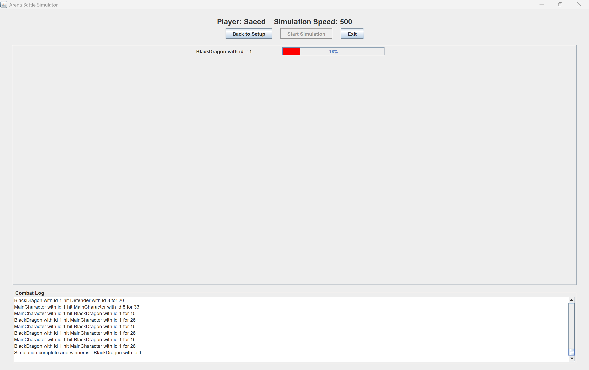

# ⚔️ Arena Simulation Game

Welcome to the **Arena Simulation Game** – a thrilling, real-time battle simulator developed in Java as part of a **Semester 3 Programming Technology** university course! 🧠💻


This simulation demonstrates a practical use of **concurrent programming** techniques,  
bringing together several advanced features of Java into a fun and educational project.

---

## 📸 Screenshots

- 🧭 Main Menu  
  

- 🧩 Simulation Setup Page  
  

- ⚔️ Live Battle Scene  
  

- 🏆 Result & Winner  
  

---

In this interactive simulation, mighty **Orcs**, fearsome **Dragons**, and a lone **Main Character** battle it out in an epic arena.  
Only the strongest will survive! The game showcases real-time combat using **multithreading**, **GUI interactions**, and strategic **AI behavior** – all wrapped in a user-friendly Java Swing interface.

💥 By default, characters **only attack enemies from other factions**, meaning:
- **Orcs** (Fighter, Defender, Berserker) form a team.
- **Dragons** (Red, Black) battle together.
- The **Main Character** fights solo.
If the **Free-for-All mode** is enabled, everyone will fight everyone!

## 🎮 Gameplay Overview

- 👤 **Your Role**: You control the simulation setup – choose characters, start the battle, and witness the carnage!

- 🧙 **Characters**:
  - **Orcs**:
    - 🪓 **Fighter** – Balanced attacker.
    - 🛡️ **Defender** – High health, low damage.
    - ⚔️ **Berserker** – Low health, high damage.
  - **Dragons**:
    - 🔥 **Red Dragon** – Moderate HP, powerful bursts.
    - 🐉 **Black Dragon** – Tanky with consistent damage.
  - 👑 **Main Character** – A legendary warrior with high stats and durability.

- 🤖 **AI Logic**:
  - Characters move and attack in real time using random movement patterns.
  - They target only **other factions** unless **Free-for-All** mode is checked.
  - All combat behavior is controlled via the `SimulationConfig` file for flexible tuning.

---

## 🖥️ Features

- 🧵 **Multithreaded Simulation Engine**  
  Every character in the arena operates on a separate thread using Java’s `ScheduledThreadPoolExecutor`,  
  allowing real-time, concurrent movements and attacks without UI freezing.

- 🔒 **Thread Safety with Synchronization**  
  Shared resources like health bars, attack states, and the combat log are guarded using `synchronized` blocks  
  to avoid race conditions and maintain data integrity across threads.

- ⚡ **Volatile Variables for Visibility**  
  Certain flags and state variables (e.g. alive/dead status) use the `volatile` keyword  
  to guarantee immediate visibility of changes between threads — critical for timely decisions in battle.

- 📢 **Event-Driven Combat Log System**  
  An internal **publisher-subscriber architecture** dispatches combat events (attacks, damage, eliminations)  
  to the UI log panel in real time. This ensures loose coupling between game logic and display updates.

- 📊 **Real-Time Health Bars**  
  Each fighter's current HP is displayed via `JProgressBar`, updating fluidly as damage is taken.

- 🕹️ **Interactive GUI (Java Swing)**  
  A minimal and intuitive GUI provides control over the simulation and displays ongoing battle dynamics.


---

## ⚙️ Technologies Used

- ☕ Java (JDK 17+)
- 🖼️ Swing (GUI framework)
- ⏱️ ScheduledThreadPoolExecutor (Multithreading)
- 📦 Maven (Build and dependency management)

---

## 🏁 How to Play

- 🎯 Download the latest executable `.jar` from the [Releases] section.  
  **or**
- 🛠️ Clone the repo and build it using Maven:

```bash
mvn clean install
java -jar target/arena-simulation-game.jar
```

Double-click the JAR or run from command line to launch the simulation.

---

## 🎓 Educational Context

This project was created as part of the **Programming Technology** course at **ELTE Informatics – Semester 3**.  
It serves to demonstrate:

- ✅ Object-Oriented Programming and Inheritance  
- ✅ Real-Time Simulation via Multithreaded Execution  
- ✅ GUI Application Development in Java  
- ✅ Modular Architecture & Clear Separation of Concerns  

---

## 👥 Author

Developed with ❤️ by **Saeed Khanloo**.  
We hope this simulation brings you as much fun as it brought us during development and testing!

---

## 📜 License

This project is licensed under the [MIT License](LICENSE).

Feel free to fork, enhance, experiment, or just enjoy watching your characters fight to the death! 🔥⚔️🐲
